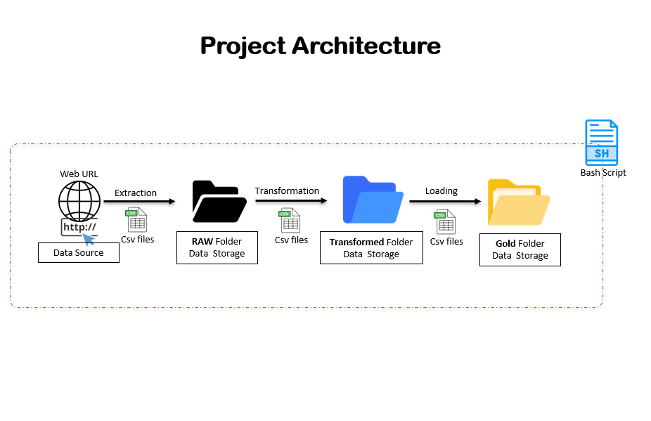
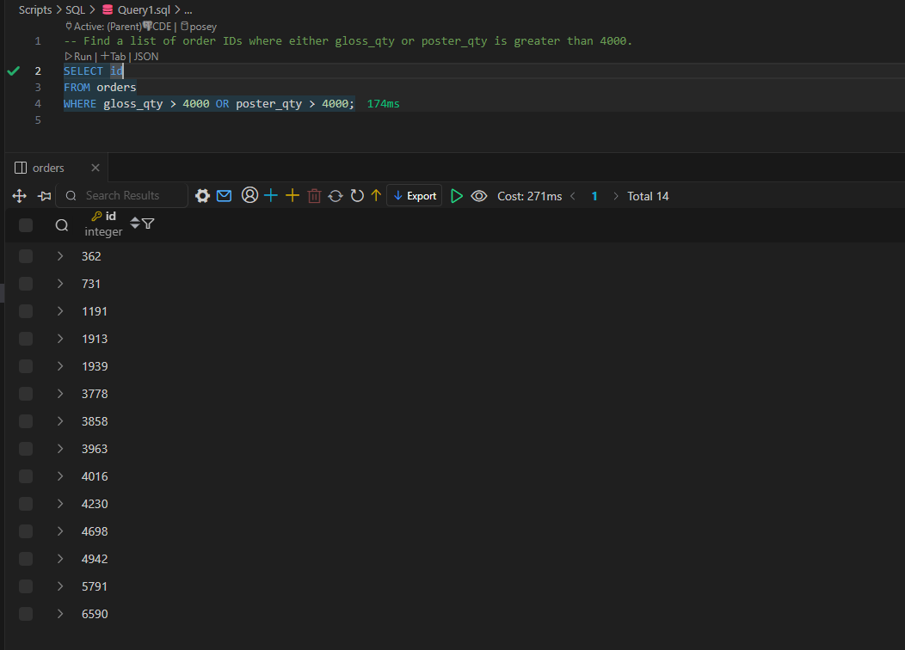
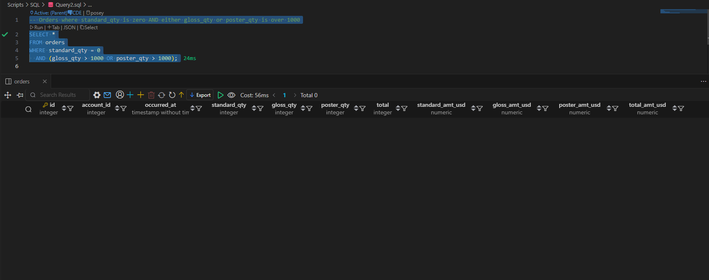
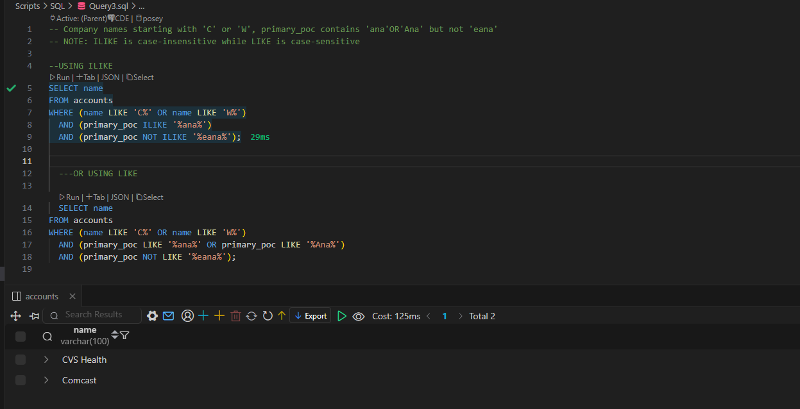
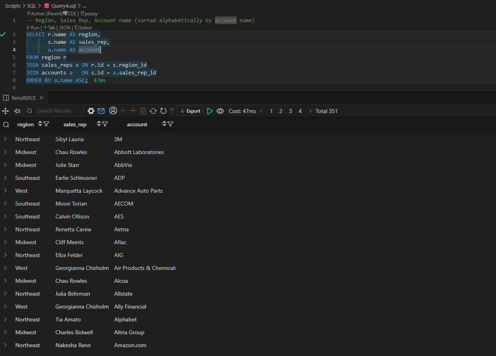

# CoreDataEngineers Project (ETL Process and Analysis)

This repository contains all the scripts and documentation for the ETL process and data analysis for CoreDataEngineers project task.

## Navigation / Quick Access
Quickly move to section you are interested in by clicking on appropriate link:
- [Scripts](#scripts)
- [ETL Pipeline Architecture](#etl-pipeline-architecture)
- [How to use the Solution](#how-to-use-the-solution)
- [Cron Job ](#cron-job)
- [SQL Solutions](#sql-solutions)

## Scripts

### ETL Script (etl.sh)

This Bash script performs a simple ETL process:
- Extracts data from a web url data source and stores it in its raw form (CSV file format) into a "RAW" folder data storage.
- Transforms the data by renaming a column and selecting specific columns and stores it "Transformed" folder data storage.
- Loads the transformed data into a 'Gold' directory.

### File Moving Script (move_json_and_csv.sh)

This Bash script moves all CSV and JSON files from one directory to another.

### PostgreSQL Import Script (csv_to_postgres.sh)

This script imports CSV files into a PostgreSQL database named 'posey', while leveraging on docker to run the postgres and pgAdmin engine.

### SQL Analysis Queries (Query1.sql,Query2.sql,Query3.sql,Query4.sql)

This SQL script contains queries to answer specific business questions about the Parch and Posey data.

## ETL Pipeline Architecture



## How to use the Solution

1. Ensure you have gitbash and docker installed and also the necessary permissions to execute the Bash scripts.
2. Create a .env file in the root directory and put in values for the following missing database credentials/variables:
#### PostgreSQL credentials
POSTGRES_USER=
POSTGRES_PASSWORD=
POSTGRES_DB=posey

#### Networking
DB_HOST=localhost
DB_PORT=5432

#### Docker service names
POSTGRES_CONTAINER_NAME=postgres-setup
PGADMIN_CONTAINER_NAME=pgadmin-setup

#### pgAdmin credentials
PGADMIN_DEFAULT_EMAIL=admin@admin.com
PGADMIN_DEFAULT_PASSWORD=

3. Run the scripts in the following order on your gitbash terminal:
   - source ./etl.sh 
   - source ./move_json_and_csv.sh
   - source ./csv_to_postgres.sh             #To Append data to existing tables
   - source ./csv_to_postgres.sh --reset     #To Truncate tables before loading

Run this scripts on a linux or wsl terminal:
   - source ./scripts/bash/scheduler.sh    

4. Use the SQL queries in the Scripts/SQL directory to analyze the imported data.

## Cron Job

The ETL script is scheduled to run daily at 12:00 AM using the following cron job:

```
0 0 * * * ./scripts/bash/etl.sh
```

## SQL Solutions

1. Find a list of order IDs where either `gloss_qty` or `poster_qty` is greater than 4000. Only include the `id` field in the resulting table.

```sql
SELECT id
FROM orders
WHERE gloss_qty > 4000 OR poster_qty > 4000;
```


2. Write a query that returns a list of orders where the `standard_qty` is zero and either the `gloss_qty` or `poster_qty` is over 1000.

```sql
SELECT *
FROM orders
WHERE standard_qty = 0
  AND (gloss_qty > 1000 OR poster_qty > 1000);
```


3. Find all the company names that start with a 'C' or 'W', and where the primary contact contains 'ana' or 'Ana', but does not contain 'eana'.

```sql
-- NOTE: ILIKE is case-insensitive while LIKE is case-sensitive

--USING ILIKE
SELECT name
FROM accounts
WHERE (name LIKE 'C%' OR name LIKE 'W%')
  AND (primary_poc ILIKE '%ana%')
  AND (primary_poc NOT ILIKE '%eana%');

  ---OR 

  ---USING LIKE
  SELECT name
FROM accounts
WHERE (name LIKE 'C%' OR name LIKE 'W%')
  AND (primary_poc LIKE '%ana%' OR primary_poc LIKE '%Ana%')
  AND (primary_poc NOT LIKE '%eana%');
```


4. Provide a table that shows the region for each sales rep along with their associated accounts. Your final table should include three columns: the region name, the sales rep name, and the account name. Sort the accounts alphabetically (A-Z) by account name.

```sql
SELECT r.name AS region,
       s.name AS sales_rep,
       a.name AS account
FROM region r
JOIN sales_reps s ON r.id = s.region_id
JOIN accounts a   ON s.id = a.sales_rep_id
ORDER BY a.name ASC;
```


